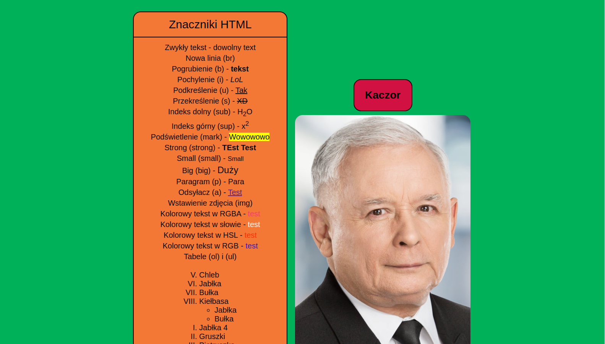

    <h3>HTML basics</h3>
    

    School project of the basics of creating websites
     
    <a href="https://bart0llo.github.io/tsiai/" target="_blank"><strong>View page</strong></a>
    

    

## About The Project

Page created during the lesson "Tworzenie stron i aplikacji internetowych". Approximately 8 teaching hours were devoted.

## Built With

## License
Distributed under the MIT License. See LICENSE.txt for more information.

## Author
👤 **Bartek**

* Website: https://bart0llo.dev
* GitHub: [@Bart0llo](https://github.com/Bart0llo)
